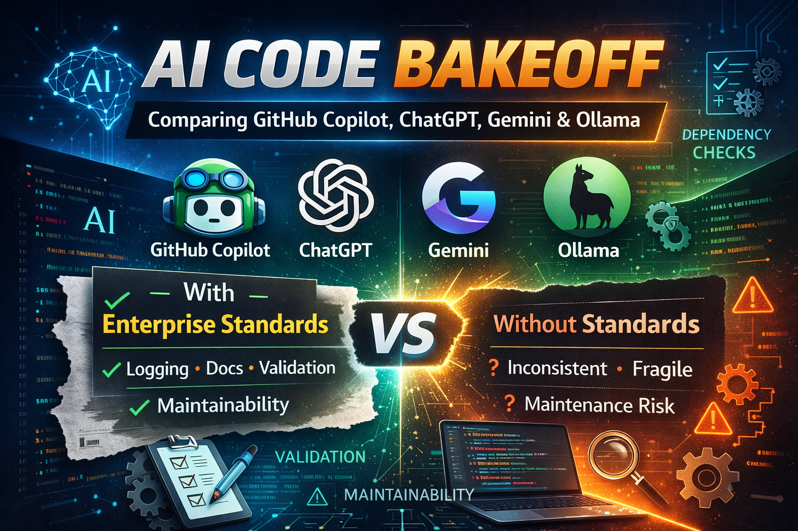

# 2026-03-GenAIBakeoff
A GenAI Bake Off between 4x tools with and without the mock enterprise standards applied.  

See `./EnterpriseStandards.md` for the mock enterprise standards I made.  
See `./ReadMe-PodcastDownloader` for the project spec I made.  
  
To feed these into your own GenAI platform do:
```
Hi, Please use the ReadMe to make a podcast downloader bash script that adheres to the enterprise coding standards in the standards file.
```

or 

```
Hi, Please use the ReadMe to make a podcast downloader bash script based off the readme.
```

You can also see the article written on my linkedin/blog:
- [https://adamjamesclark.com/2026/03/01/bakeoff-why-you-need-enterprise-standards-for-ai-compared-across-4x-different-tools](https://adamjamesclark.com/2026/03/01/bakeoff-why-you-need-enterprise-standards-for-ai-compared-across-4x-different-tools/?utm_campaign=social_post&utm_source=github&utm_medium=social_media)
- [https://www.linkedin.com/feed/update/urn:li:activity:7434227768873103360/?originTrackingId=9KwZ2ewpGLsmnDQHyI7NSQ%3D%3D](https://www.linkedin.com/feed/update/urn:li:activity:7434227768873103360/?originTrackingId=9KwZ2ewpGLsmnDQHyI7NSQ%3D%3D)
  
